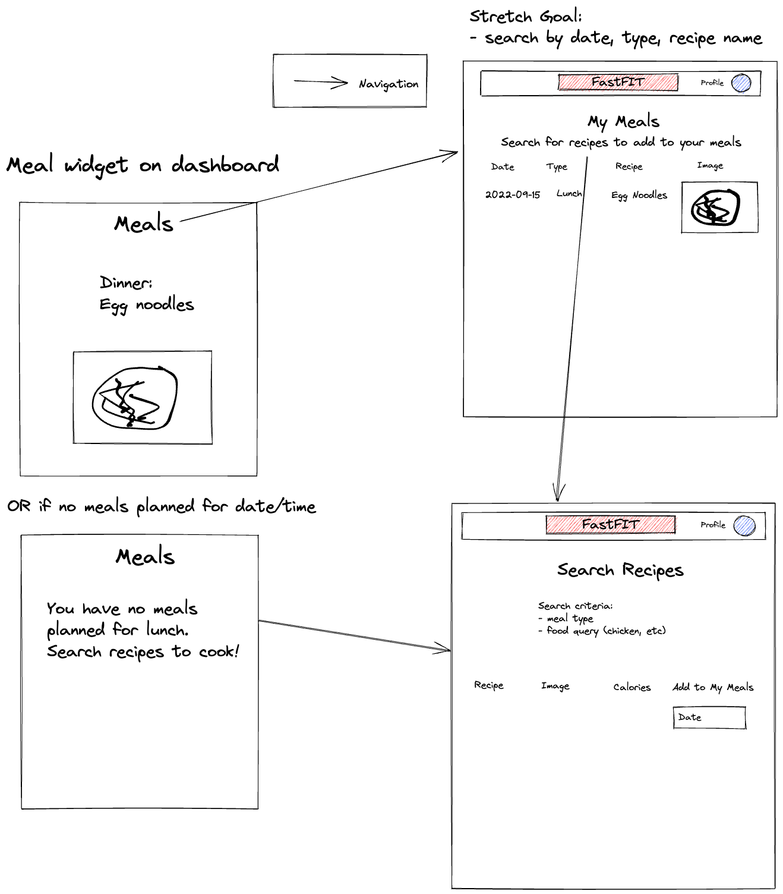

# Graphical Human Interface

## Dashboard

This is the main page that people will see when they
log in to the Web site.

- Landing page is polling the data from the other microservices and displaying on different widgets. Additionally, we have the two widgets for Weather and Inspirational Quotes. As they click the widget it will lead them to the main page of each microservice. In addition, user can access the links through the Nav Bar.

## Journal

This is the journal microservice.

- The main page: User can indicate their mood based on the mood meter. The page also displays the total entries from the user as well as the current streak from the user.

- The journal form: The data from the mood board is carried over to the form. User will fill out and submit the form for the entry being generated.

- The journal list: This page will show the list of all entries. There is button on the page to access pop up modal that display the detaild journal.

## Recipes

This is the recipe microservice.

- User meals: the dashboard will have a navlink to the My Meals page which shows a list of all meals users' have saved ordered by date.

- Search meals: users can search for recipes based on a meal type (Breakfast, Lunch, or Dinner) and a food query. In the row results, a date can be added and the recipe saved to their meals.
